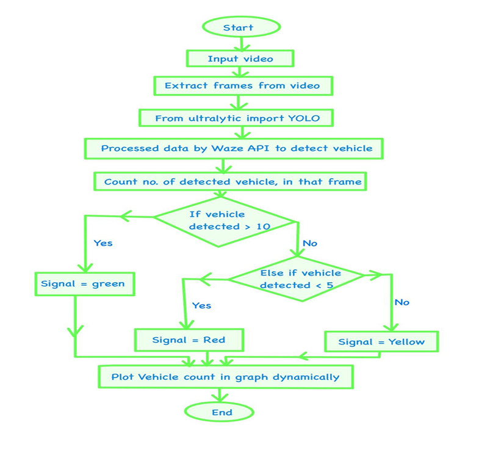

# 🚦 AI Traffic Controller

## 🔍 Overview
**AI Traffic Controller** is an intelligent traffic management system that uses AI algorithms to optimize traffic signals in real-time.  
It reduces congestion, improves traffic flow, and adapts dynamically to changing traffic conditions.  

---

## ✨ Features
- 🟢 Real-time traffic monitoring  
- 🔄 Adaptive traffic light control  
- 🤖 AI-based decision making to minimize vehicle waiting time  
- 📊 Visual simulation of traffic flow  
- 💻 User-friendly GUI/dashboard  

---

## 🛠️ Tech Stack

| Category | Technologies |
|-----------|--------------|
| **Programming Language** | Python 3.11+ |
| **AI/ML Frameworks** | TensorFlow • PyTorch (if used) |
| **Computer Vision / Image Processing** | OpenCV |
| **GUI / Visualization** | Tkinter • Matplotlib / Seaborn (optional) |
| **Database (if applicable)** | SQLite / MySQL (if storing logs) |
| **Version Control** | Git • GitHub |
| **Build / Dependency Management** | pip / requirements.txt |
| **Other Integrations** | Traffic simulation scripts • CSV/JSON data handling |

---

## ⚙️ Installation
1. Clone the repository:  
   ```bash
   git clone https://github.com/your-username/ai-traffic-controller.git
2. Navigate to the project folder:
   ```bash
     cd ai-traffic-controller
4. Install the required dependencies:
   ```bash
     pip install -r requirements.txt

---

## 📌 Workflow Diagram



📁 Project Structure
```bash
   ai-traffic-controller/
   │
   ├─ main.py            # Main script to run the traffic simulation
   ├─ traffic_model.py   # AI traffic control logic
   ├─ utils.py           # Helper functions and utilities
   ├─ assets/            # Images, GIFs, videos used in simulation
   ├─ requirements.txt   # Python dependencies
   └─ README.md          # Project documentation

```
---

## Contributors

<table>
  <tr>
    <td align="center">
      <a href="https://github.com/Tanushka-Chavan">
        <br/>
        <sub><b>Tanushka Chavan</b></sub>
      </a>
    </td>
    <td align="center">
      <a href="https://github.com/nielmandhare">
        <br/>
        <sub><b>Niel Mandhare</b></sub>
      </a>
    </td>
    <td align="center">
      <a href="https://github.com/10kgDumbbell">
        <br/>
        <sub><b>Poorva Chougule</b></sub>
      </a>
    </td>
    <td align="center">
      <a href="https://github.com/Manaswin05">
        <br/>
        <sub><b>Manaswin05</b></sub>
      </a>
    </td>
  </tr>
</table>

---
---

**🤝 Collaboration & Contact**

For usage, contributions, or collaboration opportunities, feel free to reach out:  
📧 **tanushkachavan99@gmail.com**

---

**📜 License**

This project is licensed under the **MIT License**.  
For more information, visit: https://opensource.org/licenses/MIT

---


     
